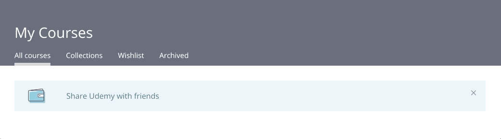

# Week 4 Challenge: Nav Indicators

## Overview

Between Weeks 1-2, you did a lot of work and learning on Balancing Act. One of the big challenges at that time was building out the functionality so a user could click a nav icon, then see a different "view". That nav icon also needed to have the turquoise border to indicate it was currently selected.

Today, you'll build out similar functionality. We aren't too worried about the comp recreation, more so on the functionality. You should be able to recognize the progress you've made since Week 1!

You'll build a small app that has this functionality:

## Iterations

### Iteration 0: Basic Layout

Again, we aren't worried about the details of the comp recreation, but get a basic layout in place with HTML and CSS so that you can see what you're working with. Choose any colors/fonts you'd like.

_You shouldn't spend more than 30 minutes on this._

### Iteration 1: Nav Indicators

When each of the four nav links is clicked, that link should now have an indication that is has been clicked. All other links should not have that indication.

### Iteration 2: Changing Content

It doesn't need to be anything fancy, but create a small bit of content that is associated with each nav link. That way, when a user clicks each link, they see the associated information below.

### Iteration 3: Clean Code

Do a sweep through your code and refactor anything that needs it!
